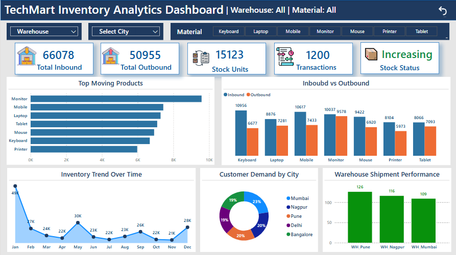

# TechMart Inventory Analytics 

## Project Overview
This project analyzes inventory movement data using SQL and Power BI to monitor stock flow, demand patterns, and inventory health.

## Objectives
* Track inbound and outbound stock
* Monitor inventory performance
* Identify top-performing products and locations
* Provide actionable insights for business decisions

## Tools & Technologies
* SQL (PostgreSQL)
* Power BI
* Excel

## Key KPIs
* Total Inbound: 66,078
* Total Outbound: 50,955
* Net Stock: 15,123
* Inventory Status: Increasing 

## Dashboard Features
* Dynamic slicers (Warehouse, Product, City)
* KPI cards with icons
* Inventory performance chart (Inbound vs Outbound)
* Top moving products analysis
* City-wise demand distribution
* Inventory trend over time
* Clear filters button

## Key Insights
* Moniter is the highest moving product
* Mumbai has the highest customer demand
* WH_Pune handles the most shipments
* Inventory levels are currently stable

## Files
* Dataset: [TechMart_Warehouse_Dataset.xlsx](TechMart_Warehouse_Dataset.xlsx)
* Power BI File: [Inventory_Dashboard.pbix](Inventory_Dashboard.pbix)
* Sql File: [Techmart_Analysis.sql](Techmart_Analysis.sql)

## Dashboard Preview

## Project Highlights
* End-to-end pipeline: Excel → SQL → Power BI
* Dynamic dashboard with interactive insights
* Business-focused KPI design

